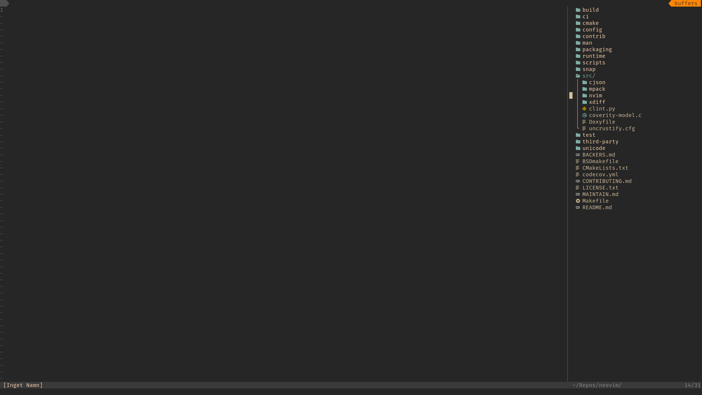
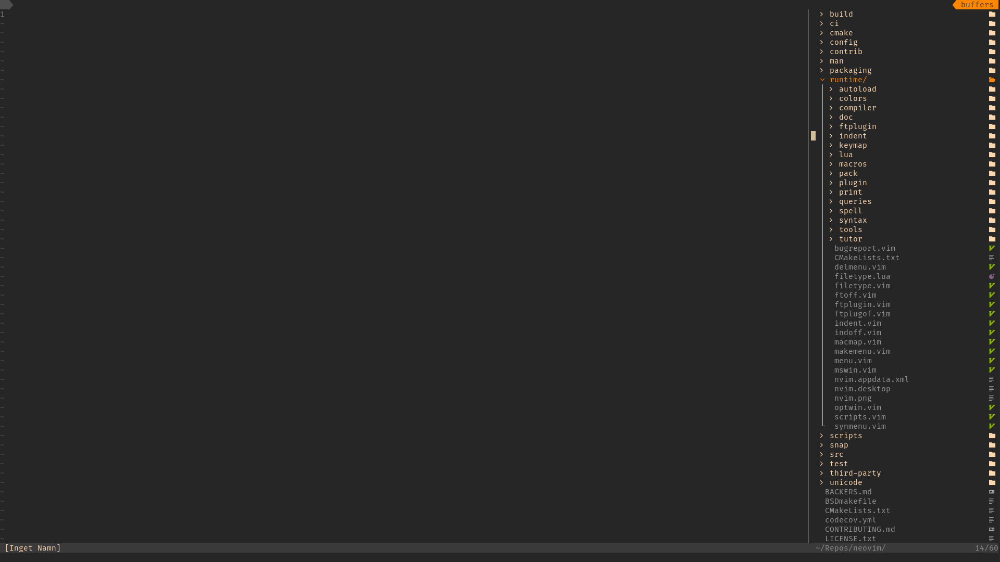

# A file tree plugin for Neovim written in Lua
Requires Neovim 0.7+

### Features
* Create files
* Create directories
* Copy files
* Move files
* Remove files
* Yank files
* Paste files
* Preview files
* Much customization

### Example conifg file
```
local FileTree = require("filetree")
local Mapping = FileTree.Mapping
FileTree:setup({

  directory = vim.fn.getcwd(),

  highlight = {
    dir = {ctermfg = "blue"},
    dir_expanded = {ctermfg = "blue"},
    file = {ctermfg = "white"}
  },

  view = {
    position = "right",
    width = 40,
    height = 40,
    indent = 2,
    line_width = 6,
    show_dot_files = false,

    indent_markers = {
      enable = true,
      symbols = {
	edge = "│",
	corner = "└"
      }
    },

    file_symbols = {
      dir = {symbol = "", hlg = "filetree_dir"},
      dir_expanded = {symbol = "", hlg = "filetree_dir_expanded"},
      file = ""
    },

    file_names = {
      dir = {prefix = "/"},
      dir_expanded = {prefix = "/"}
    },
  },

  mapping = {
    wrap_cursor = true,
    close_children = true,
    yank_file_names = "path",
    keymaps = {
      ["j"] = Mapping:cursor_down(),
      ["k"] = Mapping:cursor_up(),
      ["l"] = Mapping:open(),
      ["h"] = Mapping:close(),
      ["<Enter>"] = Mapping:enter(),
      ["w"] = Mapping:mark(false),
      ["W"] = Mapping:mark(true),
      ["N"] = Mapping:make_file(),
      ["K"] = Mapping:make_directory(),
      ["r"] = Mapping:rename(),
      ["R"] = Mapping:rename("name"),
      ["e"] = Mapping:rename("ext"),
      ["c"] = Mapping:copy(),
      ["m"] = Mapping:move(),
      ["x"] = Mapping:remove(),
      ["y"] = Mapping:yank(),
      ["p"] = Mapping:paste(),
      ["P"] = Mapping:pack(false),
      ["C"] = Mapping:compress(false),
      ["i"] = Mapping:info(),
      ["v"] = Mapping:preview(),
      ["."] = Mapping:toggle_hidden(),
      [","] = Mapping:redraw(),
      [";"] = Mapping:reload(),
      ["<Esc>"] = Mapping:clear()
    }
  },

  file_preview = {
    quit_on_esc = true,
    type = "float",
    relative = "editor",
    absolute = false,
    width = 0.9,
    height = 0.7,
    row = 0.5,
    col = 0.5,
    border = "single",
    number = true,
    relativenumber = true
  },

  filters = {
    exclude = {
      dot_files = false,
      pattern = ""
    }
  },

  actions = {
    sort_nodes = {
      method = "name",
      directories = "top",
      reverse = false
    },

    root_changed = {
      change_cwd = false
    },

    open_file = {
      quit_tree = false,
      window_picker = {
	enable = true,
	ids = "aoeuhtns",
	exclude = {
	  buftypes = {"nofile", "help"},
	  bufnames = {}
	}
      }
    }
  }

})
_G.filetree:enable_extension("icons", {position = "first"})
vim.cmd("FTreeOpen")
```

### Screenshots


